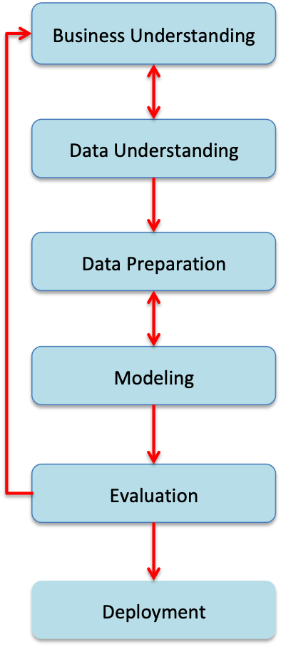

# Object-Oriented Machine Learning Pipeline for Pandas and Koalas DataFrames

## End-to-end process of developing Spark-enabled machine learning pipeline using Pandas, Koalas, Scikit-Learn, and mlflow

In the article [Python Data Preprocessing Using Pandas DataFrame, Spark DataFrame, and Koalas DataFrame](https://towardsdatascience.com/python-data-preprocessing-using-pandas-dataframe-spark-dataframe-and-koalas-dataframe-e44c42258a8f), I used a public dataset to evaluate and compare the basic functionality of Pandas, Spark, and Koalas DataFrames in typical data preprocessing steps for machine learning. 

In the article [Object-Oriented Machine Learning Pipeline with mlflow for Pandas and Koalas DataFrames](https://towardsdatascience.com/object-oriented-machine-learning-pipeline-with-mlflow-for-pandas-and-koalas-dataframes-ef8517d39a12), I use the [Interview Attendance Problem for Kaggle competition](https://www.kaggle.com/vishnusraghavan/the-interview-attendance-problem) to demonstrate an end-to-end process of developing a machine learning pipeline for both Pandas and Koalas dataframes using Pandas, Koalas, Scikit-Learn, and mlflow. This is achieved by:
* Developing a scikit-learn data preprocessing pipeline using Pandas with scikit-learn
* Developing a scikit-learn data preprocessing pipeline for Spark by combining scikit-learn with Koalas
* Developing a machine learning pipeline by combining scikit-learn with mlflow

The end-to-end development process is based on the [Cross-industry standard process for data mining](https://en.wikipedia.org/wiki/Cross-industry_standard_process_for_data_mining). As shown in the diagram below, it consists of six major phases:
* Business Understanding
* Data Understanding
* Data Preparation
* Modeling
* Evaluation
* Deployment

For convenience of discussion, it is assumed that the following Python libraries have been installed on a local machine such as Mac:
* Anaconda (conda 4.7.10) with Python 3.6, Numpy, Pandas, Matplotlib, and Scikit-Learn
* [pyspark 2.4.4](https://spark.apache.org/releases/spark-release-2-4-4.html)
* [Koalas](https://github.com/databricks/koalas)
* [mlflow](https://www.mlflow.org/docs/latest/index.html)

## 1. Business Understanding

The key point of business understanding is to understand the business problem to be solved. As an example, the following is a brief description of the Kaggle interview attendance problem: 

Given a set of questions that are asked by a recruiter while scheduling an interview with a candidate, how to use the answers to those questions from the candidate to determine whether the expected attendance is yes, no, or uncertain.

## 2. Data Understanding

Once the business problem is understood, the next step is to identify where (i.e., data sources) and how we can collect data from which a machine learning solution to the problem can be built. 

The labeled dataset for the Kaggle interview attendance problem has been collected as a csv file from the recruitment industry in India by the researchers over a period of more than 2 years between September 2014 and January 2017.  

The following table shows the first five rows of the raw dataset. This dataset is collected for supervised machine learning and the column of Observed Attendance holds the labels.

## 3. Data Preparation

The main goal of data preparation is to transform the raw dataset into appropriate format so that the transformed data can be effectively consumed by a target machine learning model. 

In the raw dataset, the column of Name(Cand ID)	contains candidate unique identifier, which does not have much prediction power and thus can be dropped. In addition, all of the columns (i.e., columns from _c22 to _c26 for Koalas dataframe, or columns from Unnamed: 22 to Unnamed: 26 for Pandas dataframe) have no data and thus can safely be dropped as well.

Except for the date of interview, all of the other columns in the dataset have categorical (textual) values. In order to use machine learning to solve the problem, those categorical values must be transformed into numerical values because a machine learning model can only cosume numerical data. 

The column of Date of Interview should be splitted into Day, Month, and Year to increase prediction power since the information of individual Day and Month can be more coorelated with seasonable jobs compared with a string of date. 

The columns of Nature of Skillset and Candidate Native location have a large number of unique entries. These will introduce a large number of new derived features after one-hot encoding. Too many features can lead to a [curse of dimensionality](https://en.wikipedia.org/wiki/Curse_of_dimensionality) problem. To alleviate such problem, the values of these two columns are re-divided into a smaller number of buckets.

The above data preprocessing/transformation can be summarized as following steps:
* Bucketing skillset
* Bucketing candidate native location
* Parsing interview date
* Changing categorical values to uppercase and dropping less useful features 
* One-Hot encoding categorical values

These steps are implemented by developing an Object-Oriented data preprocessing pipeline for both Pandas and Koalas dataframes using Pandas, Koalas and scikit-learn pipeline API (i.e., BaseEstimator, TransformerMixin, Pipeline).

### 3.1 Transforming Column Values

Several data preprocessing steps share a common operation of transforming the values of a particular column in a Koalas dataframe. But, as described in [Koalas Series](https://koalas.readthedocs.io/en/latest/reference/api/databricks.koalas.Series.iloc.html#databricks.koalas.Series.iloc), the Koalas Series does not support some of the common Pandas indexing mechanisms such as df.iloc[0]. Because of this, there is no simple method of traversing and changling the values of a column in a Koalas dataframe. The other difficulty is that Koalas does not allow to build a new Koalas Series object from scratch and then add it as a new column in an existing Koalas dataframe. It only allows to use a new Koalas Series object that is built from the existing columns of a Koalas dataframe. These difficulties are avoided by defining a global function to call the apply() method of a Koalas Series object. 

### 3.2 Bucketing Skillset

To alleviate the curse of dimensionality issue, the transform() method of the BucketSkillset class divides the unique values of the skillset column into smaller number of buckets by combining those values that appear less than 9 times into one same value of Others.

### 3.3 Bucketing candidate native location
Similarly to bucketing skillset, to alleviate the curse of dimensionality issue, the transform() method of the BucketLocation class divides the unique values of the candidate native location column into smaller number of buckets by combining those values that appear less than 12 times into one same value of Others.

### 3.4 Parsing Interview Date

The values of the column of Date of Interview are messy in that various formats are used. For instance not only different delimits are used to separate day, month, and year, but also different orders of day, month, and year are followed. This is handled by the local \_parseDate() and transform_date() methods of the ParseInterviewDate class.  The overall functionality of the transform() method is to separate the interview date string into individual day, month, and year values. 

### 3.5 Changing Categorical Values to Uppercase and Dropping Less Useful Features

The transform() method of the FeaturesUppercase class is to change the values of categorical features to uppercase and at the same time drop less useful features.

### 3.6 One-Hot Encoding Categorical Values

The transform() method of the OneHotEncodeData class calls the get_dummies() method of Koalas dataframe to one-hot encode the values of categorical values. 

## 4. Modeling

Once the dataset has been prepared, the next step is modeling. The main goals of modeling are:
* Identify machine learning algorithm
* Create and train machine learning model
* Tune the hyperparameters of machine learning algorithm

In this article we use the scikit-learn RandomForestClassifier algorithm for demonstration purpose. Grid search is used to tune the hyperparameters (number of estimators and max depth) of the algorithm, and mlflow is used to train model, track, and compare the performance metrics of different models. 

The GridSearch class is to implement grid search and the method of mlFlow() of the PredictInterview class is to call other methods to train model, use a trained model to predict results, and record model performance metrocs using mlflow API.

## 5. Evaluation

Once a machine learning model is trained with expected performance, the next step is to assess the prediction results of the model in a controlled close-to-real settings to gain confidence that the model is valid, reliable, and meets business requirements before deployment.

As an example, for the Kaggle interview attendance project, one possible method of evaluation is to use mlflow to deploy the model as a Web service locally and then develop a client program to call the model Web service to get the prediction results of a testing dataset processed by data preparation. These prediction results can then be used to generate a table or csv file for recruitment industry domain experts to review.

The code below obtains a probability and a prediction for each of the candidates where the "Observed Attendance" column is null.

## 6. Deployment

Once the model evaluation includes that the model is ready for deployment, the final step is to deploy an evaluated model into a production system. As described in [Data Science for Business](http://data-science-for-biz.com/), the specifics of deployment depend on the target production system. 

Taking the Kaggle interview attendance project as an example, one possible scenario is to deploy the model as a Web service on a server, which can be called by other components in a target production system to get prediction results. In a more complicated scenario that the development of the target production system is based on a programming language that is different from the modeling lanuage (e.g., Python), then the chance is that the model needs to be reimplemented in the target programming language as a component of the production system.  

As described before, mlflow has built-in capability of starting a logged model as a Web service:

mlflow models serve -m /Users/yuhuang/yuefeng/machine-learning-spark/mlruns/0/258301f3ac5f42fb99e885968ff17c2a/artifacts/random_forest_model -p 1234

## Summary

In this article, I use a close-to-real challenging dataset, the [Interview Attendance Problem for Kaggle competition](https://www.kaggle.com/vishnusraghavan/the-interview-attendance-problem), to demonstrate an end-to-end process of developing a machine learning pipeline for both Pandas and Koalas dataframes by combining Pandas and Koalas with Scikit-Learn and mlflow. This end-to-end development process follows the [Cross-industry standard process for data mining](https://en.wikipedia.org/wiki/Cross-industry_standard_process_for_data_mining). A brief description for each of the major phases of the standard process is provided. 